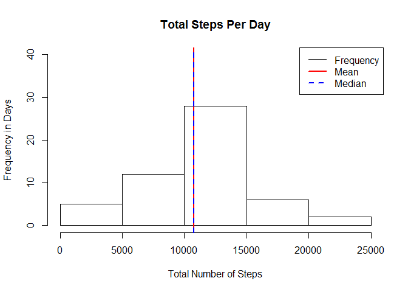
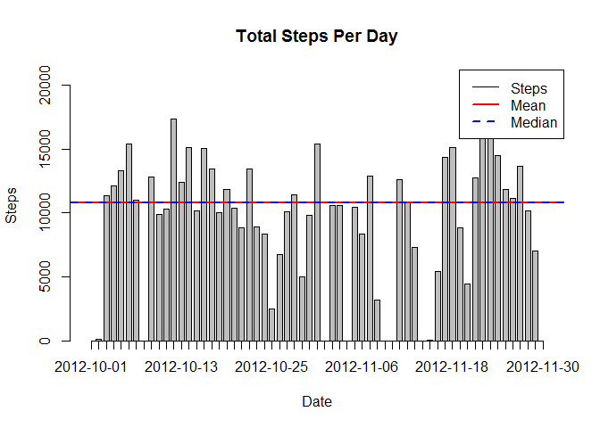
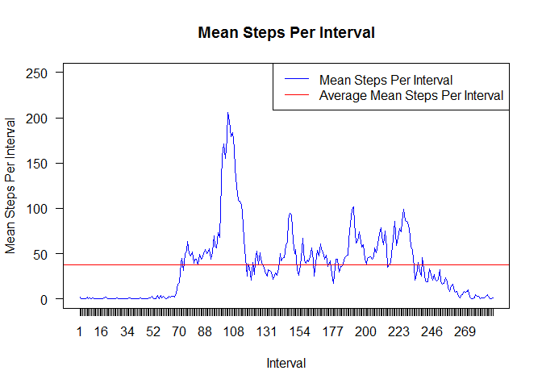
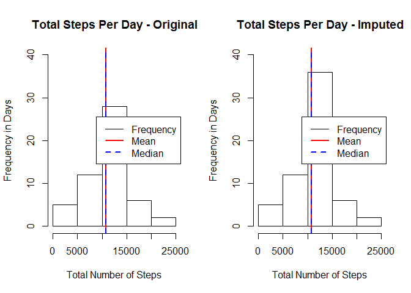
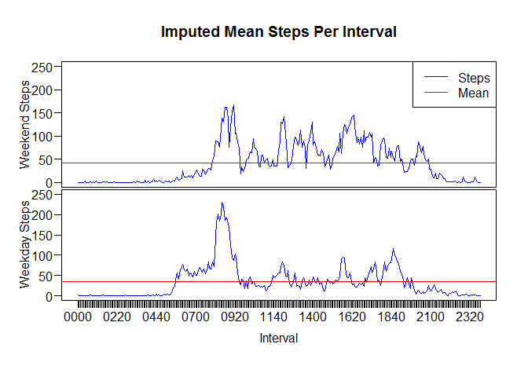
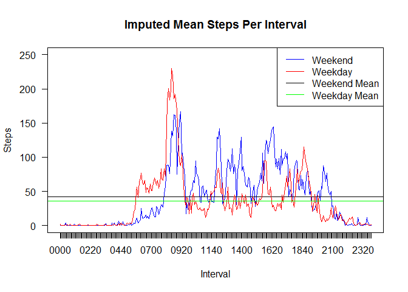

# Reproducible Research: Peer Assessment 1
Ken Wade  
24 Jan 2016  


# Introduction - Slightly modified from the assignment [README.md](https://github.com/KenWade/RepData_PeerAssessment1/blob/master/README.md) file

It is now possible to collect a large amount of data about personal
movement using activity monitoring devices such as a
[Fitbit](http://www.fitbit.com), [Nike
Fuelband](http://www.nike.com/us/en_us/c/nikeplus-fuelband), or
[Jawbone Up](https://jawbone.com/up). These type of devices are part of
the "quantified self" movement -- a group of enthusiasts who take
measurements about themselves regularly to improve their health, to
find patterns in their behavior, or because they are tech geeks. But
these data remain under-utilized both because the raw data are hard to
obtain and there is a lack of statistical methods and software for
processing and interpreting the data.

This assignment makes use of data from a personal activity monitoring
device. This device collects data at 5 minute intervals through out the
day. The data consists of two months of data from an anonymous
individual collected during the months of October and November, 2012
and include the number of steps taken in 5 minute intervals each day.

# Data

The data for this assignment can be downloaded from the course web
site:

* Dataset: [Activity monitoring data](https://d396qusza40orc.cloudfront.net/repdata%2Fdata%2Factivity.zip) [52K]

**HOWEVER, the actual dataset used is from the [GitHub repository specified for this assignment.](http://github.com/rdpeng/RepData_PeerAssessment1)**

The variables included in this dataset are:

* **steps**: Number of steps taking in a 5-minute interval (missing
    values are coded as `NA`)

* **date**: The date on which the measurement was taken in YYYY-MM-DD
    format

* **interval**: Identifier for the 5-minute interval in which
    measurement was taken

The dataset is stored in a comma-separated-value (CSV) file and there
are a total of 17,568 observations in this
dataset.


# Loading and preprocessing the data

First setup the RStudio working directory, names of the folders and filenames, and details for consistent plots.


```r
setwd("C:/Users/Ken/Documents/Ken/Continuing Education/Johns Hopkins School of Public Health - Data Science 5 - Reproducible Research/RepData_PeerAssessment1")

dataFolderName <- "data"
plotFolderName <- "figures"

zipFileName    <- "activity.zip"
dataFileName   <- "activity.csv"

maxMeanSteps   <- 250
maxDailySteps  <- 40
```

### 1.  Load the data (i.e. read.csv()) - only UnZipping it if it hasn't been before.


```r
if(!file.exists(dataFolderName)) {
    dir.create(dataFolderName)
}
if(!file.exists(paste("./", dataFolderName, "/", dataFileName, sep=""))) {
    unzip(zipFileName, exdir=paste("./", dataFolderName, sep=""))
}
activity <- read.csv(paste("./", dataFolderName, "/", dataFileName, sep=""))
```

### 2. Process/transform the data (if necessary) into a format suitable for your analysis.

Preprocess the data by creating a 4-character string of the interval *intervalstring* and a POSIXlt format date and time column *datetime*


```r
activity$intervalstring <- formatC(activity$interval, width=4, flag="0")
activity$datetime <- strptime(paste(activity$date, activity$intervalstring), "%Y-%m-%d %H%M")
```


# What is mean total number of steps taken per day?

To calculate the mean total number of steps taken per day we aggregate the data into the sum of steps for each day. To visualize this information we display this daily step information three ways; first as a histogram of frequency of number of total steps per day, then as a simple graph of total steps per day, and finally as set of summary statistics.


```r
totalStepsPerDay <- aggregate(activity$steps, by = list(activity$date), FUN=sum, na.rm=FALSE)
names(totalStepsPerDay) <- c("date", "steps")
```

### 1. Make a histogram of the total number of steps taken each day.


```r
hist(totalStepsPerDay$steps, main="Total Steps Per Day", xlab="Total Number of Steps",
     ylab="Frequency in Days", ylim=c(0,maxDailySteps), breaks=5)
abline(v = mean(totalStepsPerDay$steps, na.rm=TRUE), col = "red", lwd = 2)
abline(v = median(totalStepsPerDay$steps, na.rm=TRUE), col = "blue", lty=2, lwd = 2)
legend("topright", c("Frequency", "Mean", "Median"),lty=c(1,1,2),col=c("black", "red", "blue"), lwd=c(1,2,2))
```



```r
barplot(totalStepsPerDay$steps, main="Total Steps Per Day", names.arg = totalStepsPerDay$date, axis.lty = 1,
        space = 0.4, xlab="Date", ylab="Steps", ylim=c(0, max(totalStepsPerDay$steps, na.rm=TRUE)),
        col = "gray")
abline(h = mean(totalStepsPerDay$steps, na.rm=TRUE), col = "red", lwd = 2)
abline(h = median(totalStepsPerDay$steps, na.rm=TRUE), col = "blue", lty=2, lwd = 2)
legend("topright", c("Steps", "Mean", "Median"),lty=c(1,1,2),col=c("black", "red", "blue"), lwd=c(1,2,2))
```



### 2. Calculate and report the **mean** and **median** total number of steps taken per day

The summary statistics for the number of steps per day are:

```r
summary(totalStepsPerDay$steps)
```

```
##    Min. 1st Qu.  Median    Mean 3rd Qu.    Max.    NA's 
##      41    8841   10760   10770   13290   21190       8
```


# What is the average daily activity pattern?

To calculate the average daily activity pattern we aggregate the data into the sum of steps for each interval. To visualize this information we display this daily step information two ways; first as set of summary statistics then as a simple graph of mean steps per interval.


```r
meanStepsPerInterval <- aggregate(activity$steps, by = list(activity$intervalstring), FUN=mean, na.rm=TRUE)
names(meanStepsPerInterval) <- c("intervalstring", "steps")
```

The summary statistics for the number of steps per interval are:


```r
summary(meanStepsPerInterval$steps)
```

```
##    Min. 1st Qu.  Median    Mean 3rd Qu.    Max. 
##   0.000   2.486  34.110  37.380  52.830 206.200
```

### 1. Make a time series plot (i.e. type = "l") of the 5-minute interval (x-axis) and the average number of steps taken, averaged across all days (y-axis)


```r
plot(meanStepsPerInterval$steps, type="l", axes=FALSE, ann=FALSE,
     ylim=c(0, max(maxMeanSteps, meanStepsPerInterval$steps, na.rm=TRUE)), col = "blue")
abline(h = mean(meanStepsPerInterval$steps), col = "red")
legend("topright", c("Mean Steps Per Interval", "Average Mean Steps Per Interval"),
       lty=c(1,1),col=c("blue","red"))
axis(1, at=1:nrow(meanStepsPerInterval), lab=meanStepsPerInterval$intervalstring)
axis(2, las=1, at=50*0:maxMeanSteps)
box()
title(main="Mean Steps Per Interval", xlab="Interval", ylab="Mean Steps Per Interval")
```



### 2. Which 5-minute interval, on average across all the days in the dataset, contains the maximum number of steps?


```r
meanIntervalWithMostStepsValue <- round(max(meanStepsPerInterval$steps))
meanIntervalWithMostSteps <- meanStepsPerInterval$intervalstring[which.max(meanStepsPerInterval$steps)]
```

Nex we find which 5-minute interval, on average across all the days in the dataset, contains the maximum number of steps.

    Interval: 0835
    Mean:     206 steps.


# Imputing missing values

Note that there are a number of days/intervals where there are missing values (coded as NA). The presence of missing days may introduce bias into some calculations or summaries of the data.

Before calculating the imputed values it is important to review the summary statistics for the number of steps.

### 1. Calculate and report the total number of missing values in the dataset (i.e. the total number of rows with NAs)


```r
N <- nrow(activity)
numNA <- sum(is.na(activity$steps))
summary(activity$steps)
```

```
##    Min. 1st Qu.  Median    Mean 3rd Qu.    Max.    NA's 
##    0.00    0.00    0.00   37.38   12.00  806.00    2304
```

NA's account for 2304 of 17568 observations = 13.1% of the total ovservations.

### 2. Devise a strategy for filling in all of the missing values in the dataset. The strategy does not need to be sophisticated. For example, you could use the mean/median for that day, or the mean for that 5-minute interval, etc.

To devise a strategy for filling in all of the missing values in the dataset the code is set up to iterate thru all the activity observations.  This allows different imput strategies to be tested easily.  Perhaps this is not the fastest execution method to accomplish task but it has allowed easy testing of different strategies.

Three simple stratigies were tested:

* Replace NA values with the average of the daily mean and interval mean
* Replace NA values with the interval mean
* Replace NA values with the daily mean
 
It is my humble opinion that replacing NA values with the interval mean is "better".  By that I mean it is not impacted by the NA's from the complete missing days and best preserved the nighttime quiet which "seems" the most reasonable imput strategy of the three.  Although this method does add artifacts to both the weekend and weekday intervals because the same interval profile is added to both.

### 3. Create a new dataset that is equal to the original dataset but with the missing data filled in.


```r
imputedActivity <- activity   # creates the new activity dataset
checkcount <- 0                  # NA counter to check the code

for (i in 1:N) {
  if (is.na(activity$steps[i])) {
    day <- as.integer(difftime(activity$datetime[i], activity$datetime[1], units="days")) + 1
    interval <- ((as.integer(substr(activity$intervalstring[i], 1, 2)) * 60) +
                  as.integer(substr(activity$intervalstring[i], 3, 4)))  / 5 + 1
    imputedActivity$steps[i]  = meanStepsPerInterval$steps[interval]
    checkcount <- checkcount + 1
  }
}

interval <- aggregate(imputedActivity$steps, by = list(imputedActivity$intervalstring), FUN=mean, na.rm=TRUE)
names(interval) <- c("intervalstring", "steps")
```

### 4. Make a histogram of the total number of steps taken each day and Calculate and report the mean and median total number of steps taken per day. Do these values differ from the estimates from the first part of the assignment? What is the impact of imputing missing data on the estimates of the total daily number of steps?

Notice the change in summary statistics between the Original and Imputed step counts.

```r
summary(activity$steps)
```

```
##    Min. 1st Qu.  Median    Mean 3rd Qu.    Max.    NA's 
##    0.00    0.00    0.00   37.38   12.00  806.00    2304
```

```r
summary(imputedActivity$steps)
```

```
##    Min. 1st Qu.  Median    Mean 3rd Qu.    Max. 
##    0.00    0.00    0.00   37.38   27.00  806.00
```

Notice there is no change in summary statistics between the Original and Imputed interval counts.

```r
summary(meanStepsPerInterval$steps)
```

```
##    Min. 1st Qu.  Median    Mean 3rd Qu.    Max. 
##   0.000   2.486  34.110  37.380  52.830 206.200
```

```r
summary(interval$steps)
```

```
##    Min. 1st Qu.  Median    Mean 3rd Qu.    Max. 
##   0.000   2.486  34.110  37.380  52.830 206.200
```

When comparing the histograms between the Original and Imputed step counts it is easy to see the new average days being added to the observations.

```r
day <- aggregate(imputedActivity$steps, by = list(imputedActivity$date), FUN=sum, na.rm=FALSE)
names(day) <- c("date", "steps")

par(mfrow=c(1,2))
hist(totalStepsPerDay$steps, main="Total Steps Per Day - Original", xlab="Total Number of Steps",
     ylab="Frequency in Days", ylim=c(0,maxDailySteps), breaks=5)
abline(v = mean(totalStepsPerDay$steps, na.rm=TRUE), col = "red", lwd = 2)
abline(v = median(totalStepsPerDay$steps, na.rm=TRUE), col = "blue", lty=2, lwd = 2)
legend("right", c("Frequency", "Mean", "Median"),lty=c(1,1,2),col=c("black", "red", "blue"), lwd=c(1,2,2))

hist(day$steps, main="Total Steps Per Day - Imputed", xlab="Total Number of Steps",
     ylab="Frequency in Days", ylim=c(0,maxDailySteps), breaks=5)
abline(v = mean(day$steps, na.rm=TRUE), col = "red", lwd = 2)
abline(v = median(day$steps, na.rm=TRUE), col = "blue", lty=2, lwd = 2)
legend("right", c("Frequency", "Mean", "Median"),lty=c(1,1,2),col=c("black", "red", "blue"), lwd=c(1,2,2))
```



Yes, the values differ from the estimates from the first part of the assignment.

Notice that by using the imputed activity values basically the 8 NA days have been returned to the total observations.  These 8 days are basically 8 average days so the mean and median are almost unchanged.  The interval statistics are unchanged because added intervals are the means.


# Are there differences in activity patterns between weekdays and weekends?

Use the dataset with the filled-in missing values for this part.

### 1. Create a new factor variable in the dataset with two levels -- "weekday" and "weekend" indicating whether a given date is a weekday or weekend day.

To see if there are differences in the activity patterns between weekdays and weekns we create a new factor variable in the dataset with two levels - "weekday" and "weekend" indicating whether a given date is a weekday or weekend day.

*$wday* returns numeric weekday (0-6 starting on Sunday). Therefore, 0 or 6 are weekend days.

Once the weekend and weekday step counts are seperated and the weekend and weekday interval data is aggregated the required panel plot is generated to show the very different interval profiles.


```r
imputedActivity$daytype <- factor(ifelse(imputedActivity$datetime$wday==0 | imputedActivity$datetime$wday==6,
                             "weekend", "weekday"))

weekend <- subset(imputedActivity, imputedActivity$daytype == "weekend")
weekday <- subset(imputedActivity, imputedActivity$daytype == "weekday")

weekendInterval <- aggregate(weekend$steps, by = list(weekend$intervalstring), FUN=mean, na.rm=TRUE)
names(weekendInterval) <- c("intervalstring", "steps")

weekdayInterval <- aggregate(weekday$steps, by = list(weekday$intervalstring), FUN=mean, na.rm=TRUE)
names(weekdayInterval) <- c("intervalstring", "steps")
```


### 2. Make a panel plot containing a time series plot (i.e. type = "l") of the 5-minute interval (x-axis) and the average number of steps taken, averaged across all weekday days or weekend days (y-axis).


```r
par(mfrow=c(2,1))
par(mar=c(0, 4, 4, 2) + 0.1)
par(mgp = c(2, 0.6, 0))

plot(weekendInterval$steps, type="l", axes=FALSE, ann=FALSE,
     ylim=c(0, max(maxMeanSteps, weekendInterval$steps, na.rm=TRUE)), col = "blue")
abline(h = mean(weekendInterval$steps), col = "red")
legend("topright", c("Steps", "Mean"),lty=c(1,1),col=c("blue", "red"), lwd=c(1,1))
axis(2, las=1, at=50*0:maxMeanSteps)
box()
title(main="Imputed Mean Steps Per Interval", ylab="Weekend Steps")

par(mar=c(5, 4, 0, 2) + 0.1)
plot(weekdayInterval$steps, type="l", axes=FALSE, ann=FALSE,
     ylim=c(0, max(maxMeanSteps, weekdayInterval$steps, na.rm=TRUE)), col = "blue")
abline(h = mean(weekdayInterval$steps), col = "red")
axis(1, at=1:nrow(weekdayInterval), lab=weekdayInterval$intervalstring)
axis(2, las=1, at=50*0:maxMeanSteps)
box()
title(xlab="Interval", ylab="Weekday Steps")
```



Overlaying the weekend and weekday data is an alternate presentation.


```r
plot(weekendInterval$steps, type="l", axes=FALSE, ann=FALSE, 
     ylim=c(0, max(maxMeanSteps, weekendInterval$steps, na.rm=TRUE)), col = "blue")
abline(h = mean(weekendInterval$steps), col = "black")
lines(weekdayInterval$steps, type="l", axes=FALSE, ann=FALSE,
     ylim=c(0, max(maxMeanSteps, weekdayInterval$steps, na.rm=TRUE)), col = "red")
```

```
## Warning in plot.xy(xy.coords(x, y), type = type, ...): "axes" is not a
## graphical parameter
```

```r
abline(h = mean(weekdayInterval$steps), col = "green")
legend("topright", c("Weekend", "Weekday", "Weekend Mean", "Weekday Mean"),lty=c(1,1,1,1),col=c("blue", "red", "black", "green"), lwd=c(1,1,1,1))
axis(1, at=1:nrow(weekdayInterval), lab=weekdayInterval$intervalstring)
axis(2, las=1, at=50*0:maxMeanSteps)
box()
title(main="Imputed Mean Steps Per Interval", xlab="Interval", ylab="Steps")
```


